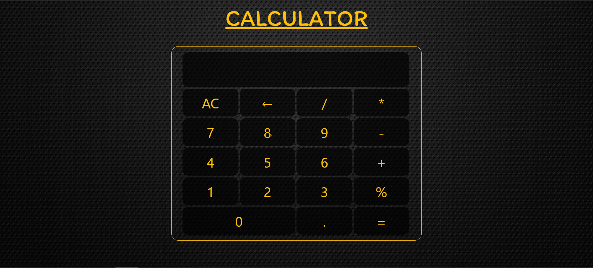

# Calculator

## Description
It is a Simple Calculator made using Javascript and jQuery

#### Steps:
---

- Download or clone the repository
```
git clone https://github.com/Saup21/Calculator.git
```
- Go to the directory
- Run the index.html file
- Calculate

<br/>

#### Calculator image:
---



#### Tech stack:
---
- HTML5
- CSS3
- Bootstrap
- Javascript
- jQuery
